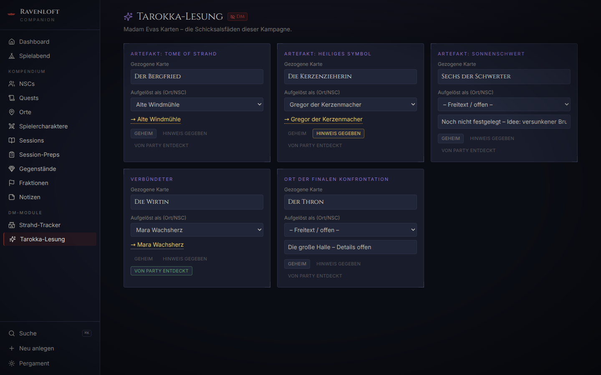
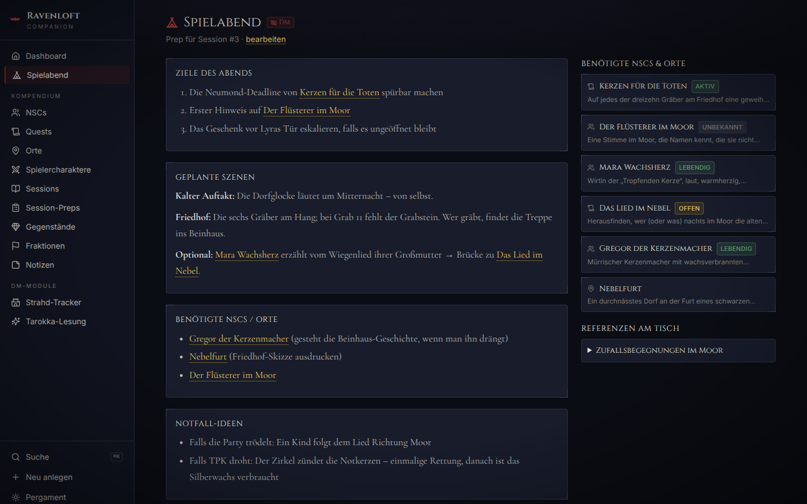

# 🦇 Ravenloft Companion

A self-hosted campaign management tool for running **Curse of Strahd** (D&D 5e) as a Dungeon Master — built to replace an Obsidian vault with something purpose-made: linked entities, spoiler-safe player exports, and a dashboard for the trackers that matter in Barovia.

> **UI language: German.** The interface, seed data and in-code documentation are written in German; this README is in English for the wider community.


<p align="center">
  
  
</p>

<p align="center">
  
  
</p>

*Screenshots show the fictional demo campaign from `data.example/` (DM mode, dark theme).*

## What it does

The tool runs in two modes:

|            | **DM mode** (local)                     | **Player mode** (static)            |
| ---------- | --------------------------------------- | ----------------------------------- |
| How        | `npm run dev` – Express API + React app | `npm run build:player` – static SPA |
| Editing    | Full CRUD on everything                 | Read-only                           |
| DM secrets | Visible, marked with red “DM” badges    | **Removed by a whitelist filter**   |
| Hosting    | Your machine, fully offline             | GitHub Pages (or any static host)   |

### Features

- **Entities with templates** — NPCs, quests, locations, player characters, sessions, session preps, items, factions and free-form reference notes, each with a sensible section structure and per-entity campaign log.
- **Wikilinks & backlinks** — type `[[Name]]` (with autocomplete) in any Markdown field to link entities, Obsidian-style. Links render with hover previews; every detail page lists automatic backlinks (“Erwähnt in …”). Unresolved links offer one-click creation.
- **Global search** — `Cmd/Ctrl+K` fuzzy palette over names, tags and full text, grouped by type, keyboard-first.
- **Dashboard trackers** — party level, in-game day, Ireena’s bites (0–3), Strahd escalation level (1–5 with editable stage descriptions) and freely addable custom counters, all editable in place.
- **Quest board** — list, table and Kanban view (open / active / done / failed) with drag & drop.
- **Session timeline** — chronological log, each session linked to its prep; a dedicated **game-night view** shows tonight’s prep next to quick access to all linked NPCs/locations and table references (random encounter tables etc.).
- **DM special modules** — a Strahd encounter tracker (every appearance: mode, what he wanted, what he got, consequences + an idea stockpile) and the Tarokka reading (five cards, resolved targets, reveal status).
- **Spoiler-safe player build** — a whitelist-based filter (never a blacklist) exports only what is explicitly player-safe. Tests prove no DM field survives the export.
- **Gothic Barovia design** — dark blue-black default theme with blood-red and candle-gold accents, optional parchment theme, locally bundled fonts (Cinzel, Inter, Cormorant Garamond), ornamental card corners, WCAG-AA contrast, `prefers-reduced-motion` support, tablet-friendly.

## Quickstart

Requires Node.js ≥ 20.

```bash
npm install
npm run seed      # copies fictional example data from data.example/ to data/
npm run dev       # starts API server (:3001) + web app (:5173)
```

Open <http://localhost:5173>. Your real campaign lives in `data/` — plain, human-readable JSON files (one per entity), which is **gitignored** and never leaves your machine.

```bash
npm test           # Vitest: wikilink parser, spoiler filter, API CRUD, …
npm run lint       # ESLint
npm run typecheck  # strict TypeScript across all workspaces
```

## Player build & GitHub Pages

```bash
npm run build:player
```

This:

1. reads `data/`, validates it, and applies the **whitelist spoiler filter** (see rules below),
2. aborts if anything DM-flavoured would survive (paranoia check),
3. writes the filtered data to `client/public/player-data.json`,
4. builds a static, read-only SPA with a relative base path into `client/dist-player/`.

**Visibility rules** (documented in `shared/src/playerFilter.ts`):

- entities with `dmOnly: true`, session preps and the special modules are never exported;
- locations only if `besucht` (visited) is true;
- NPCs only if the party has demonstrably met them: status ≠ `unbekannt` **and** at least one campaign-log entry;
- items only if `gefunden` (found) is true;
- per entity, only explicitly whitelisted fields are copied — new fields are DM-only by default;
- references to non-exported entities are nulled so no IDs leak names.

**Deploying to Pages:** commit the (spoiler-free) `client/public/player-data.json`, push, then manually trigger the **“Spieler-Build auf GitHub Pages”** workflow (`workflow_dispatch`) — so _you_ decide when content goes public. The workflow rebuilds the static app from the committed JSON and publishes it. Test locally with `npx vite preview --outDir dist-player` inside `client/`.

## Project layout

```
shared/   types, Zod schemas, entity registry, wikilink parser, spoiler filter
server/   Express API (DM mode) – file-based JSON storage in data/
client/   React + Vite + Tailwind app (both modes)
scripts/  seed + player build
data.example/  fictional demo campaign (safe to publish)
data/     YOUR campaign – gitignored
```

See [ARCHITECTURE.md](ARCHITECTURE.md) for the data flow and a guide to adding new entity types.

## Disclaimer

This is an unofficial fan-made tool and is **not affiliated with or endorsed by Wizards of the Coast**. The repository contains **no text, stat blocks, or other content from the published _Curse of Strahd_ adventure** — `data.example/` consists entirely of original, fictional sample content. Bring your own copy of the adventure; this tool only organises _your_ notes about it.

## License

[MIT](LICENSE) — contributions welcome, see [CONTRIBUTING.md](CONTRIBUTING.md).
