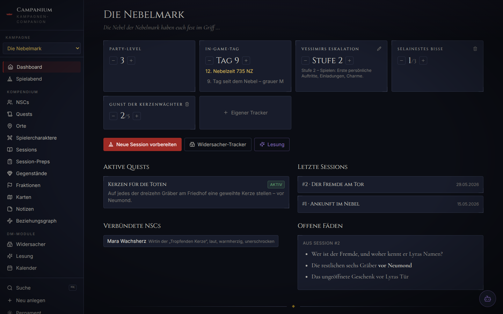
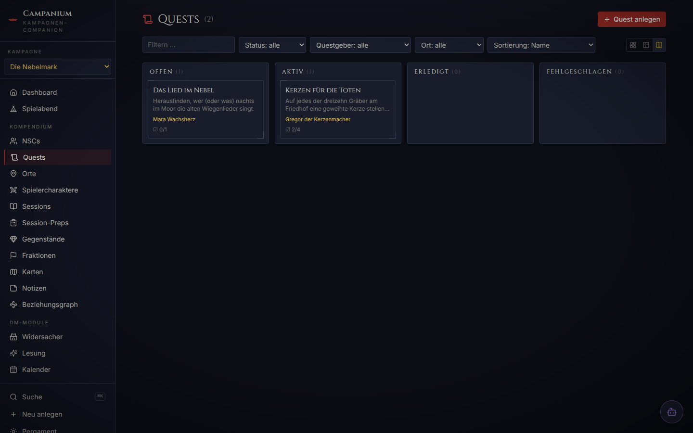
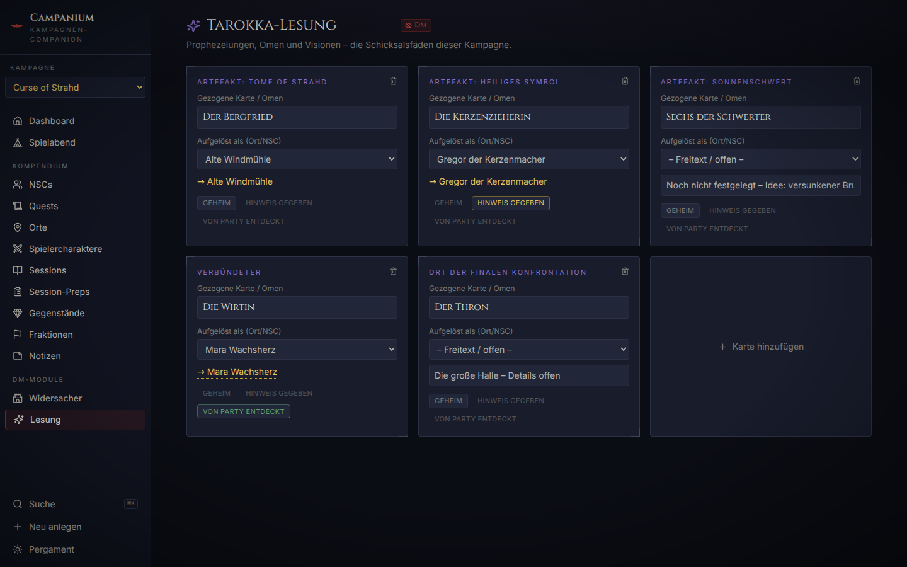
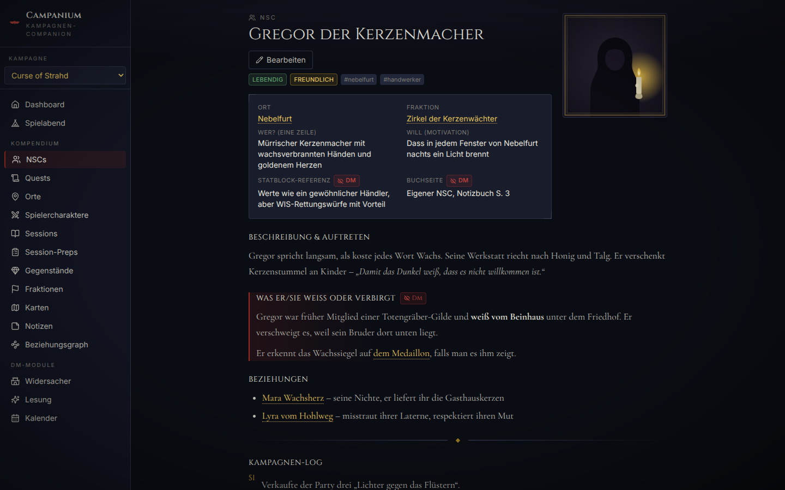
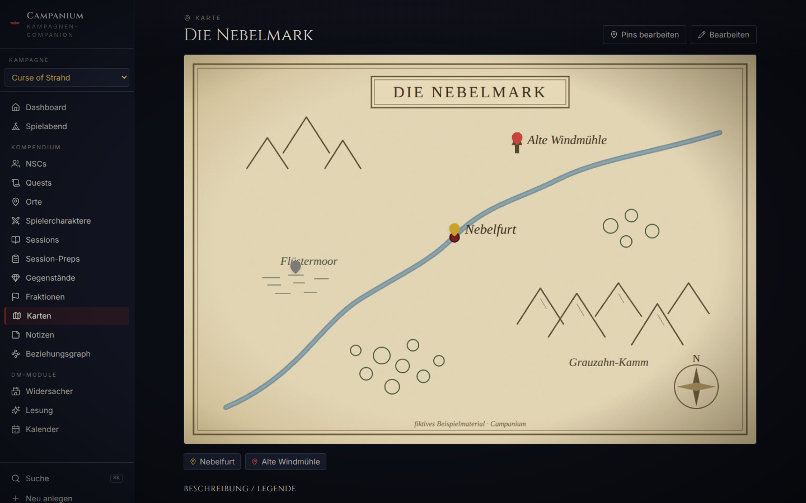
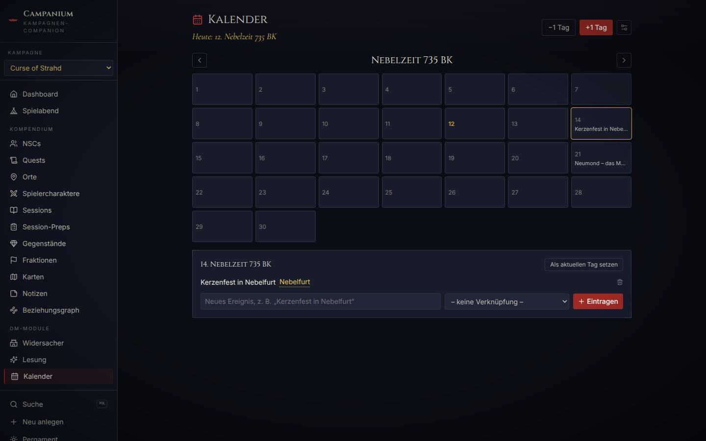
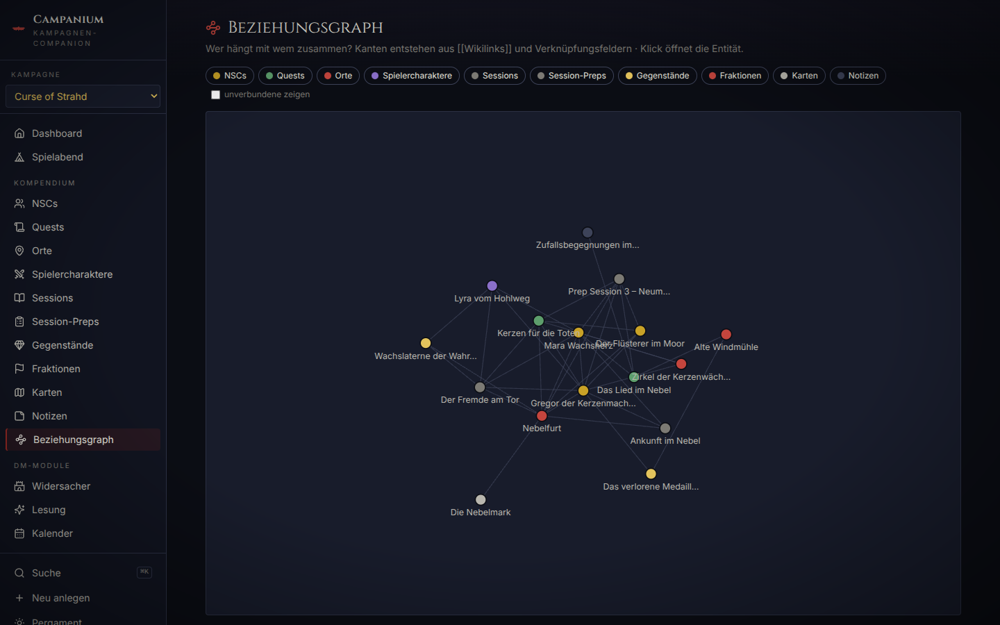
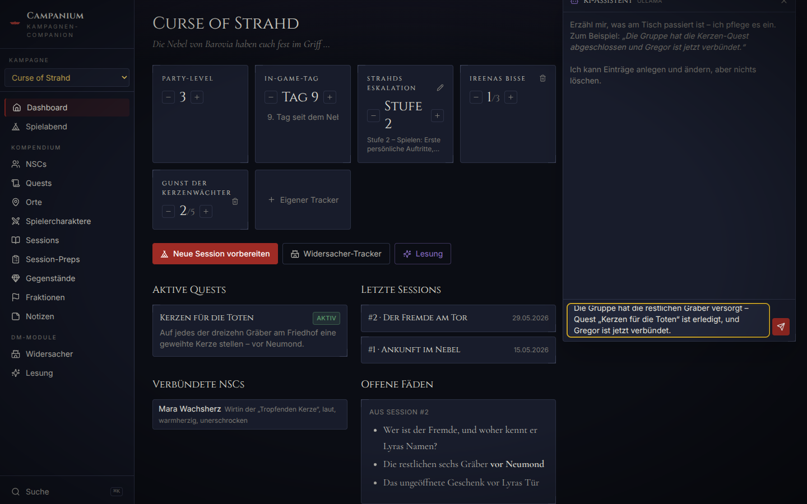

# 🦇 Campanium

A self-hosted **campaign management tool for D&D** (and similar tabletop RPGs), built to replace an Obsidian vault with something purpose-made: **multiple campaigns with an in-app switcher**, linked entities, spoiler-safe player exports, and a dashboard with the trackers that matter at your table.

It ships with a fully fleshed-out (and entirely fictional) **Curse of Strahd** demo campaign, but nothing about the tool is CoS-specific: the nemesis tracker, the oracle/reading module, escalation stages, regions and all counters are freely configurable per campaign.

> **UI language: German.** The interface, seed data and in-code documentation are written in German; this README is in English for the wider community.



<p align="center">
  
  
</p>

<p align="center">
  
  
</p>

<p align="center">
  
  
</p>

_Screenshots show the two fictional demo campaigns from `data.example/` (DM mode, dark theme)._

## What it does

The tool runs in two modes:

|            | **DM mode** (local)                     | **Player mode** (static)            |
| ---------- | --------------------------------------- | ----------------------------------- |
| How        | `npm run dev` – Express API + React app | `npm run build:player` – static SPA |
| Editing    | Full CRUD on everything                 | Read-only                           |
| DM secrets | Visible, marked with red “DM” badges    | **Removed by a whitelist filter**   |
| Hosting    | Your machine, fully offline             | GitHub Pages (or any static host)   |

### Features

- **Multiple campaigns** — each campaign is its own folder under `data/`; switch between them from the sidebar, create new ones in-app. Wikilinks, search and backlinks are always scoped to the active campaign.
- **Entities with templates** — NPCs, quests, locations, player characters, sessions, session preps, items, factions, maps and free-form reference notes, each with a sensible section structure and per-entity campaign log.
- **Images & portraits** — attach an image to any entity (PNG/JPEG/WebP/GIF, stored as plain files inside your campaign folder): portraits on detail pages and list cards, artwork for locations and items.
- **Interactive maps** — upload a map image and place pins that link to your locations; pin colours show visited/unvisited, clicking navigates to the place. The player export keeps only pins of visited locations.
- **In-game calendar** — months with custom names and lengths per campaign (two presets included), a current date that rolls cleanly over month and year boundaries, and events that can link to any entity. DM-only by design.
- **Relationship graph** — a force-directed view of how everything connects, fed by the same wikilinks and reference fields as the backlinks; filter by type, click a node to jump to its entity.
- **Wikilinks & backlinks** — type `[[Name]]` (with autocomplete) in any Markdown field to link entities, Obsidian-style. Links render with hover previews; every detail page lists automatic backlinks (“Erwähnt in …”). Unresolved links offer one-click creation.
- **Global search** — `Cmd/Ctrl+K` fuzzy palette over names, tags and full text, grouped by type, keyboard-first.
- **Dashboard trackers** — party level, in-game day, an optional escalation tracker (freely named, with editable stage descriptions — “Strahd’s escalation” in the demo) and freely addable custom counters (“Ireena’s bites 1/3”), all editable in place.
- **Quest board** — list, table and Kanban view (open / active / done / failed) with drag & drop.
- **Session timeline** — chronological log, each session linked to its prep; a dedicated **game-night view** shows tonight’s prep next to quick access to all linked NPCs/locations and table references (random encounter tables etc.).
- **DM special modules** — a **nemesis tracker** for the campaign’s arch-villain (every appearance: mode, what they wanted, what they got, consequences + an idea stockpile; “Strahd von Zarovich” in the demo) and a **reading/oracle module** with freely configurable cards (the Tarokka reading in the demo — omens or prophecies anywhere else).
- **Optional AI assistant (opt-in)** — a chat drawer for the DM that applies changes for you mid-session (“the party finished the candle quest and Gregor is now allied” → quest status, campaign logs and NPC attitude get updated). Bring your own provider: Anthropic (Claude), OpenAI, Google (Gemini), Mistral — or Ollama for a fully local setup. Disabled unless configured; see below.
- **Spoiler-safe player build** — a whitelist-based filter (never a blacklist) exports only what is explicitly player-safe. Tests prove no DM field survives the export.
- **Gothic Barovia design** — dark blue-black default theme with blood-red and candle-gold accents, optional parchment theme, locally bundled fonts (Cinzel, Inter, Cormorant Garamond), ornamental card corners, WCAG-AA contrast, `prefers-reduced-motion` support, tablet-friendly.

## Quickstart

Requires Node.js ≥ 20.

```bash
npm install
npm run seed      # copies two fictional demo campaigns from data.example/ to data/
npm run dev       # starts API server (:3001) + web app (:5173)
```

Open <http://localhost:5173>. Your real campaigns live in `data/<campaign>/` — plain, human-readable JSON files (one per entity, plus a `kampagne.json` manifest per campaign), all **gitignored** so they never leave your machine. Starting with an empty `data/` works too: the app greets you with a “create your first campaign” screen.

```bash
npm test           # Vitest: wikilink parser, spoiler filter, API CRUD, …
npm run lint       # ESLint
npm run typecheck  # strict TypeScript across all workspaces
```

## Optional: AI assistant

The AI assistant is **strictly opt-in** — without configuration the feature is completely absent from the UI. To enable it:

```bash
cp .env.example .env   # then edit .env
```

```ini
AI_PROVIDER=anthropic   # anthropic | openai | google | mistral | ollama
AI_API_KEY=sk-...       # not needed for ollama
AI_MODEL=               # optional override, sensible default per provider
```

Restart `npm run dev` — a chat button appears bottom-right (DM mode only). The assistant works through the same Zod-validated storage layer as the REST API, so it cannot produce invalid data. Every change it makes is shown as a linked action card in the chat, and **it has no delete capability** — deletion stays a manual DM action.

<p align="center">
  
</p>

**Privacy:** with a cloud provider, your campaign data (including DM notes) is sent to that provider. If you don’t want that, use `AI_PROVIDER=ollama` with a locally running [Ollama](https://ollama.com) — everything stays on your machine. API keys live only in `.env` (gitignored) and never reach the browser or the player build.

## Player build & GitHub Pages

```bash
npm run build:player                        # if data/ contains exactly one campaign
KAMPAGNE=curse-of-strahd npm run build:player   # pick one when there are several
```

This:

1. reads the chosen campaign from `data/`, validates it, and applies the **whitelist spoiler filter** (see rules below),
2. aborts if anything DM-flavoured would survive (paranoia check),
3. writes the filtered data to `client/public/player-data.json`,
4. builds a static, read-only SPA with a relative base path into `client/dist-player/`.

**Visibility rules** (documented in `shared/src/playerFilter.ts`):

- entities with `dmOnly: true`, session preps and the special modules are never exported;
- locations only if `besucht` (visited) is true;
- NPCs only if the party has demonstrably met them: status ≠ `unbekannt` **and** at least one campaign-log entry;
- items only if `gefunden` (found) is true;
- map pins only if their linked location is exported; free markers and DM pin labels are stripped;
- images are copied only for exported entities (the target folder is wiped first, so no stale files leak);
- per entity, only explicitly whitelisted fields are copied — new fields are DM-only by default;
- references to non-exported entities are nulled so no IDs leak names;
- the calendar (DM planning) is never exported.

**Deploying to Pages:** commit the (spoiler-free) `client/public/player-data.json` and `client/public/bilder/`, push, then manually trigger the **“Spieler-Build auf GitHub Pages”** workflow (`workflow_dispatch`) — so _you_ decide when content goes public. The workflow rebuilds the static app from the committed JSON and publishes it. Test locally with `npx vite preview --outDir dist-player` inside `client/`.

## Project layout

```
shared/   types, Zod schemas, entity registry, wikilink parser, spoiler filter
server/   Express API (DM mode) – file-based JSON storage, one folder per campaign
client/   React + Vite + Tailwind app (both modes)
scripts/  seed + player build
data.example/  two fictional demo campaigns (safe to publish)
data/     YOUR campaigns – gitignored
  └─ <campaign-id>/
       kampagne.json           campaign manifest (name, tagline)
       kampagnenstand.json     dashboard trackers
       widersacher-tracker.json / lesung.json / kalender.json   DM special modules
       bilder/                 uploaded images (portraits, map art)
       nsc/ quest/ ort/ …      one JSON file per entity
```

See [ARCHITECTURE.md](ARCHITECTURE.md) for the data flow and a guide to adding new entity types.

## Disclaimer

This is an unofficial fan-made tool and is **not affiliated with or endorsed by Wizards of the Coast**. The repository contains **no text, stat blocks, or other content from any published adventure** (including _Curse of Strahd_) — `data.example/` consists entirely of original, fictional sample content. Bring your own copy of whatever adventure you run; this tool only organises _your_ notes about it.

## License

[CC BY-NC 4.0](LICENSE) — open source in spirit: using, forking and building upon this project is free and welcome, **as long as you credit the original author** ([luckylucab0](https://github.com/luckylucab0)) with a link back to this repository, and **don’t use it commercially**. Full terms: <https://creativecommons.org/licenses/by-nc/4.0/>

Contributions welcome, see [CONTRIBUTING.md](CONTRIBUTING.md).
